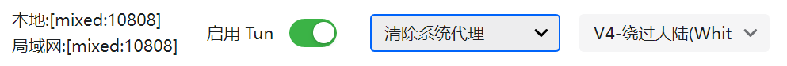
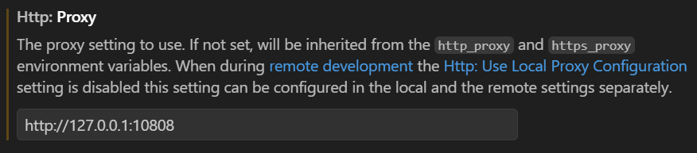

在国内内网服务器上使用codex/copilot是一件非常头疼的事情。由于网络上的屏蔽和限制，是无法畅快使用codex/copilot等国外编程工具的。具体表现为codex无法登录、强行登录也无法使用；copilot无法使用Claude系列模型。

本文将介绍一种比较优雅的解决网络限制的方法，环境为通过VS Code remote-ssh连接到服务器。

### Step1: 配置SSH远程端口转发

首先需要配置本电脑代理，并确认其监听端口。以V2rayN为例，默认监听端口为10808。



找到目标服务器SSH config，添加

```
RemoteForward 10808 127.0.0.1:10808
```

使得远程服务器上开启一个监听端口 10808，捕获所有发送到远程 10808 端口的流量，把这些流量传回本地电脑。

### Step2: 在VS Code中配置代理

设置VS Code使用本地代理



完成配置，codex已经可以正常使用！